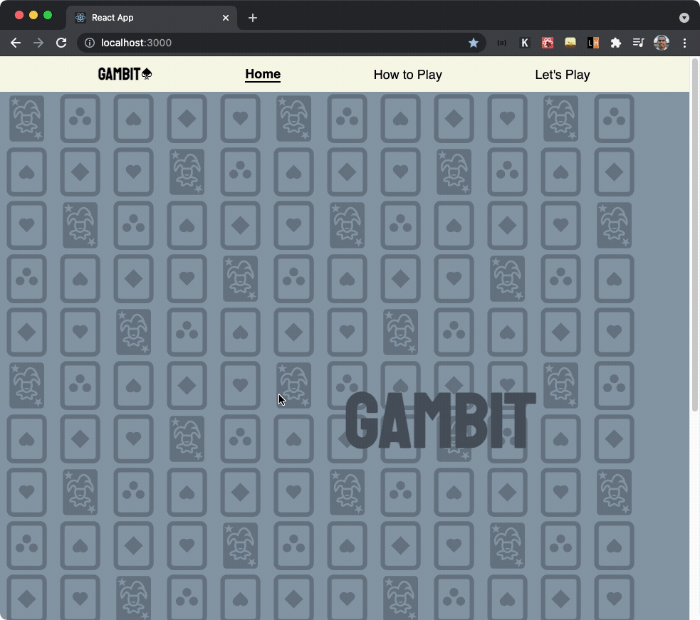

# GAMBIT♠️♦️♣️❤️ MintBean Hackathon

## Description

The purpose of this application is to create a card Game for the MintBean Hackathon. This is a front end application that re-creates the War game.The app was built with react hooks and styled components.

➡️ [Link to Deployed App](https://gambitwar.netlify.app/)

## Build With 🛠

### Frontend

        * JavaScript using React Library
        * Styled with custom CSS via Styled Components using FlexBox Layout
        * Deployed via Netlify

## Getting Started

<!--
### Dependencies

* Application was tested on Google Chrome -->

### Installation

Once the Github repo is downloaded/cloned and open in your local text editor:

- npm install to update and install dependencies
- npm start to get your local server to open the app in the browser
